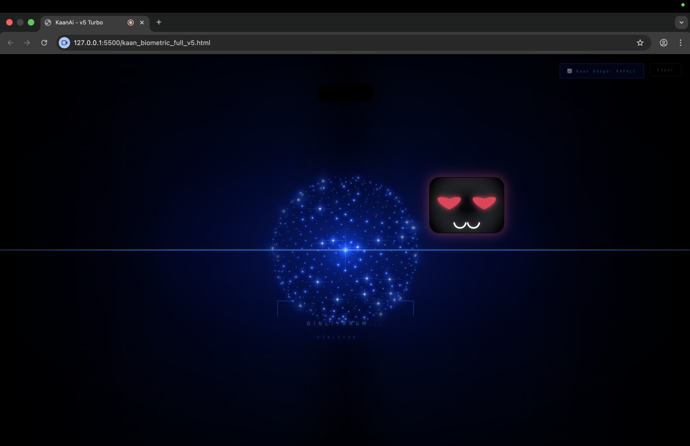
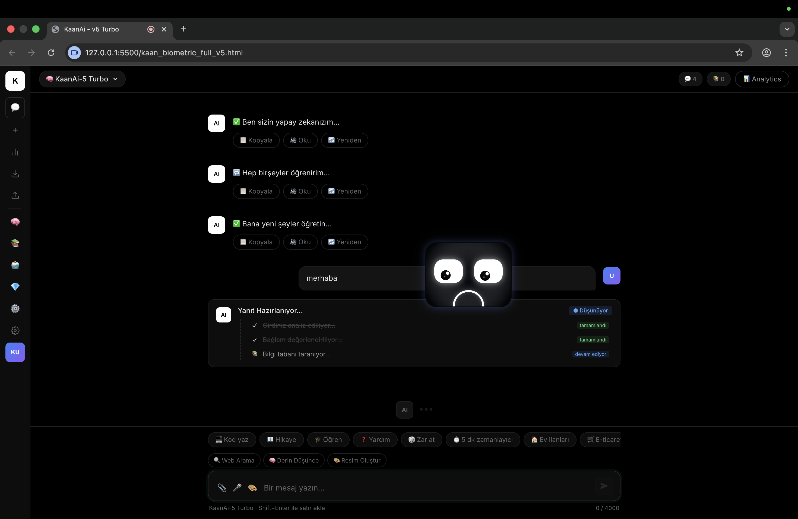
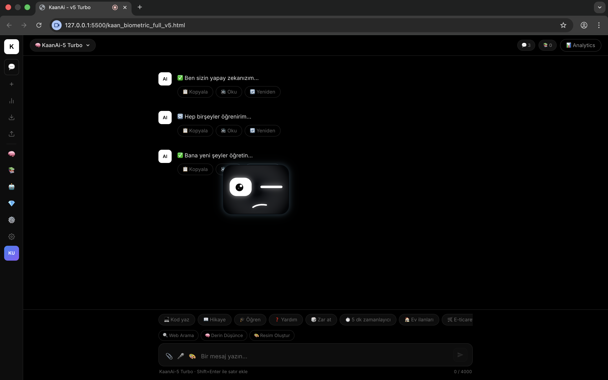
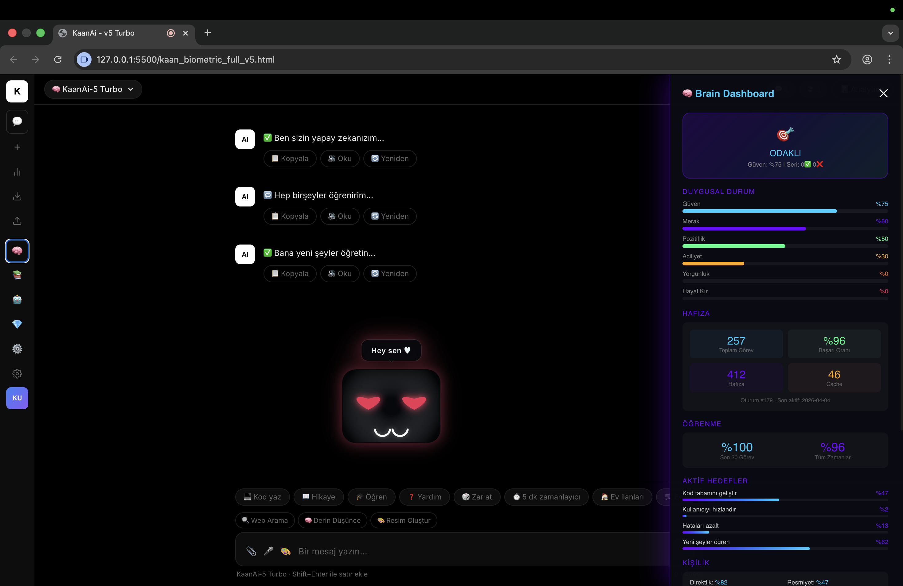

# html-ai 🤖
### Self-Learning AI Assistant with Memory + Autonomous Agents

Kullanıcı davranışını analiz eden, zamanla öğrenen ve kendini optimize eden otonom bir AI asistan sistemi. Yerel LLM (Ollama) ile çalışır — bulut API'lerine bağımlı değildir.

---

## 🚀 Ne Yapıyor?

html-ai, klasik chatbotlardan farklı olarak:

- 🧠 Kullanıcıyı zamanla **tanır ve adapte olur**
- 📚 Geçmiş konuşmalardan **bağlamsal hafıza** oluşturur (RAG)
- 🤖 Görevleri planlayıp uygulayan **otonom ajanlar** kullanır
- 🎭 Kişiye özel deneyim sunar (**AI personality system**)

---

## 🖥️ Ekran Görüntüleri






---

## 🧠 Core Özellikler

### 🧩 Memory (RAG)
- Konuşmaları ve verileri saklar
- Bağlamsal cevaplar üretir
- Uzun vadeli hafıza simülasyonu

### 🤖 Autonomous Agent
- Plan → Uygula → Değerlendir döngüsü
- Görevleri kendi başına yürütme

### 🧬 Brain System
- Kullanıcının alışkanlıklarını öğrenir
- İlgi alanlarına göre davranış değiştirir
- Duygusal durum ve kişilik metrikleri

### ⚙️ Ek Özellikler
- 📱 Telegram entegrasyonu
- 💬 WhatsApp entegrasyonu (Puppeteer)
- 🏥 Sağlık modülü (hatırlatıcı & takip)
- 🛠 Mini web uygulamaları (Excel, Word, Photoshop klonu)
- 🧑‍💻 Türkçe AI modeli (deneysel)
- 👁️ Yüz & ses tanıma (biyometrik kimlik doğrulama)

---

## 🏗️ Sistem Mimarisi

```
User Input
   ↓
RAG Memory (Geçmiş veri + bağlam)
   ↓
Brain System (Kişilik & öğrenme)
   ↓
Agent (Planlama & karar)
   ↓
LLM (Ollama - yerel)
   ↓
Response
```

---

## 🛠️ Teknolojiler

| Katman | Teknoloji |
|--------|-----------|
| Backend | Node.js, Express |
| LLM | Ollama (local) |
| Memory | RAG + SQLite |
| Bot | Telegram API, WhatsApp Web (Puppeteer) |
| Frontend | Vanilla HTML/CSS/JS |
| AI Model | Python, PyTorch (turkish_ai/) |

---

## ⚡ Kurulum

### Gereksinimler
- Node.js v18+
- [Ollama](https://ollama.ai) kurulu ve çalışıyor olmalı

### Adımlar

```bash
git clone https://github.com/kaandevs-ops/html-ai.git
cd html-ai
npm install
cp .env.example .env
node server.js
```

Tarayıcıda aç: 👉 `http://localhost:3000`

### .env Örneği

```env
PORT=3000
API_KEY=your_api_key
OLLAMA_URL=http://localhost:11434
TELEGRAM_BOT_TOKEN=your_token
```

---

## ⚠️ Not

Bu proje deneysel ve kişisel kullanım amaçlıdır. Production kullanımı için güvenlik ve ölçekleme iyileştirmeleri gereklidir.

---

## 📌 Roadmap

- [ ] Daha gelişmiş öğrenme sistemi
- [ ] UI/UX iyileştirmeleri
- [ ] Plugin/extension desteği
- [ ] Çoklu kullanıcı desteği
