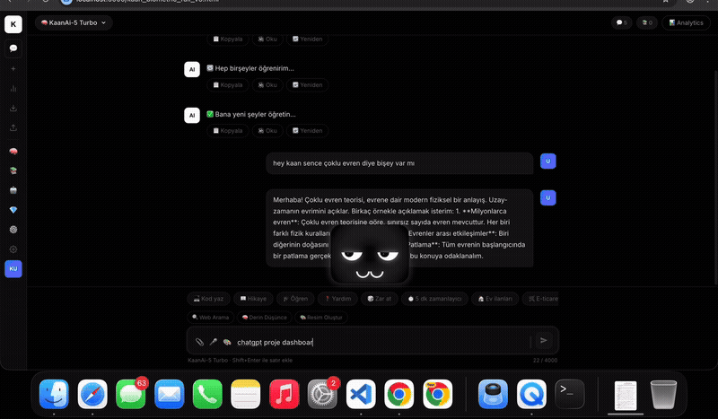
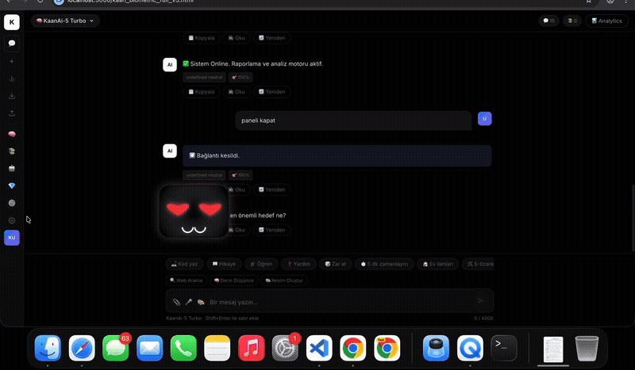
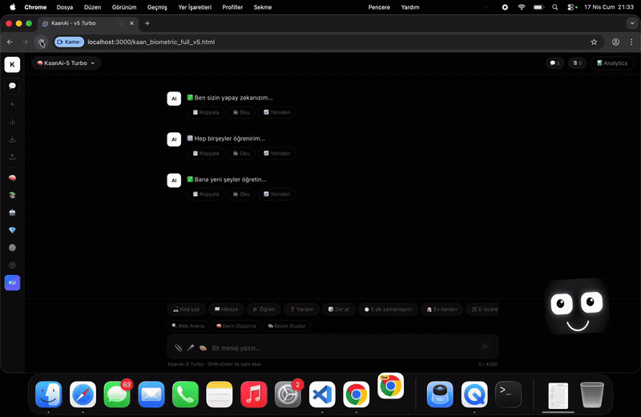
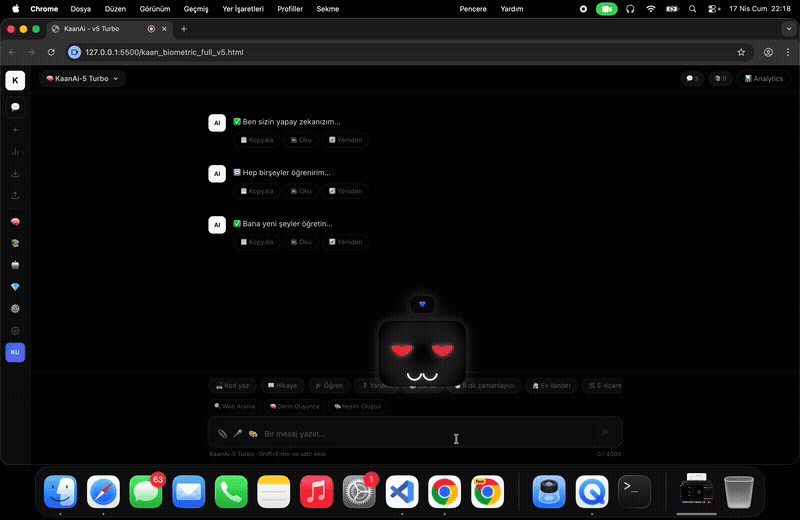

# html-ai 🤖
### Self-Learning AI Assistant with Memory + Autonomous Agents

An autonomous AI assistant system that analyzes user behavior, learns over time, and self-optimizes. Runs on a local LLM (Ollama) — no dependency on cloud APIs.

---

## 🚀 What Does It Do?

Unlike traditional chatbots, html-ai:

- 🧠 **Learns and adapts** to the user over time
- 📚 Builds **contextual memory** from past conversations (RAG)
- 🤖 Uses **autonomous agents** that plan and execute tasks
- 🎭 Delivers a personalized experience via an **AI personality system**

---

## 🖥️ Screenshots


---

## 🎬 Live Demos

### 💬 Chat Interface
> Conversational AI with memory, quick-action buttons, and real-time response streaming.



---

### 🎭 AI Personality & Emotional States
> The AI personality system reacts dynamically — switching moods, expressions, and behavior based on context.



---

### 🚀 Startup & AI Face Animation
> Biometric startup sequence with animated AI avatar and camera/mic initialization.



---

### 🔄 Full Session Walkthrough
> End-to-end demo: launching the app, interacting with the AI, and exploring core features.



---

## 🧠 Core Features

### 🧩 Memory (RAG)
- Stores conversations and data
- Generates context-aware responses
- Long-term memory simulation

### 🤖 Autonomous Agent
- Plan → Execute → Evaluate loop
- Runs tasks independently

### 🧬 Brain System
- Learns user habits over time
- Adapts behavior based on interests
- Emotional state and personality metrics

### ⚙️ Additional Features
- 📱 Telegram integration
- 💬 WhatsApp integration (Puppeteer)
- 🏥 Health module (reminders & tracking)
- 🛠 Mini web apps (Excel, Word, Photoshop clone)
- 🧑‍💻 Turkish AI model (experimental)
- 👁️ Face & voice recognition (biometric authentication)

---

## 🏗️ System Architecture

```
User Input
   ↓
RAG Memory (Past data + context)
   ↓
Brain System (Personality & learning)
   ↓
Agent (Planning & decision-making)
   ↓
LLM (Ollama - local)
   ↓
Response
```

---

## 🛠️ Tech Stack

| Layer | Technology |
|-------|------------|
| Backend | Node.js, Express |
| LLM | Ollama (local) |
| Memory | RAG + SQLite |
| Bot | Telegram API, WhatsApp Web (Puppeteer) |
| Frontend | Vanilla HTML/CSS/JS |
| AI Model | Python, PyTorch (turkish_ai/) |

---

## ⚡ Getting Started

### Prerequisites
- Node.js v18+
- [Ollama](https://ollama.ai) installed and running

### Steps

```bash
git clone https://github.com/kaandevs-ops/html-ai.git
cd html-ai
npm install
cp .env.example .env
node server.js
```

Open in browser: 👉 `http://localhost:3000`

### .env Example

```env
PORT=3000
API_KEY=your_api_key
OLLAMA_URL=http://localhost:11434
TELEGRAM_BOT_TOKEN=your_token
```

---

## ⚠️ Note

This project is experimental and intended for personal use. Security and scalability improvements are required before using in production.

---

## 📌 Roadmap

- [ ] More advanced learning system
- [ ] UI/UX improvements
- [ ] Plugin/extension support
- [ ] Multi-user support